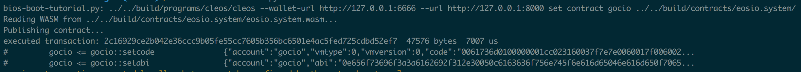
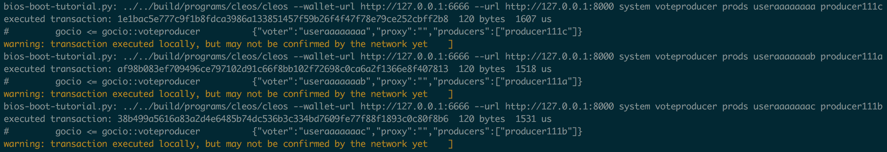
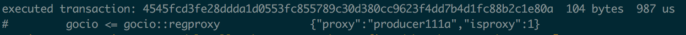

# steps 

`tutorials/bios-boot-tutorial/bios-boot-tutorial.py`

```js
commands = [
    ('k', 'kill',           stepKillAll,                True,    "Kill all nodeos and keosd processes"),
    ('w', 'wallet',         stepStartWallet,            True,    "Start keosd, create wallet, fill with keys"),
    ('W', 'new-wallet',     stepStartNewWallet,         False,   "Empty Data, Start keosd, create wallet, fill with keys"),
    ('b', 'boot',           stepStartBoot,              True,    "Start boot node"),
    ('s', 'sys',            createSystemAccounts,       True,    "Create system accounts (gocio.*)"),
    ('c', 'contracts',      stepInstallSystemContracts, True,    "Install system contracts (token, msig)"),
    ('t', 'tokens',         stepCreateTokens,           True,    "Create tokens"),
    ('S', 'sys-contract',   stepSetSystemContract,      True,    "Set system contract"),
    ('T', 'stake',          stepCreateStakedAccounts,   True,    "Create staked accounts"),
    ('g', 'goc',            stepGOC,                    True,    "Prepare goc data"),  
    ('p', 'reg-prod',       stepRegProducers,           True,    "Register producers"),
    ('P', 'start-prod',     stepStartProducers,         True,    "Start producers"),
    ('v', 'vote',           stepVote,                   True,    "Vote for producers"),
    ('R', 'claim',          claimRewards,               True,    "Claim rewards"),
    ('x', 'proxy',          stepProxyVotes,             True,    "Proxy votes"),
    ('q', 'resign',         stepResign,                 True,    "Resign eosio"),
    ('m', 'msg-replace',    msigReplaceSystem,          False,   "Replace system contract using msig"),
    ('X', 'xfer',           stepTransfer,               False,   "Random transfer tokens (infinite loop)"),
    ('l', 'log',            stepLog,                    True,    "Show tail of node's log"),
]
```
## 配置设置

```js
// eosio 默认账户的公钥私钥
parser.add_argument('--public-key', metavar='', help="EOSIO Public Key", default='GOC8Znrtgwt8TfpmbVpTKvA2oB8Nqey625CLN8bCN3TEbgx86Dsvr', dest="public_key")
parser.add_argument('--private-Key', metavar='', help="EOSIO Private Key", default='5K463ynhZoCDDa4RDcr63cUwWLTnKqmdcoTKTHBjqoKfv4u5V7p', dest="private_key")
// cleos 路径和 keosd 钱包端口
parser.add_argument('--cleos', metavar='', help="Cleos command", default='../../build/programs/cleos/cleos --wallet-url http://127.0.0.1:6666 ')
parser.add_argument('--nodeos', metavar='', help="Path to nodeos binary", default='../../build/programs/nodeos/nodeos')
parser.add_argument('--keosd', metavar='', help="Path to keosd binary", default='../../build/programs/keosd/keosd')
// 智能合约路径, 各种路径
parser.add_argument('--contracts-dir', metavar='', help="Path to contracts directory", default='../../build/contracts/')
parser.add_argument('--nodes-dir', metavar='', help="Path to nodes directory", default='./nodes/')
parser.add_argument('--genesis', metavar='', help="Path to genesis.json", default="./genesis.json")
parser.add_argument('--wallet-dir', metavar='', help="Path to wallet directory", default='./wallet/')
parser.add_argument('--log-path', metavar='', help="Path to log file", default='./output.log')
parser.add_argument('--symbol', metavar='', help="The gocio.system symbol", default='SYS')
// 导入钱包的最大用户数量
parser.add_argument('--user-limit', metavar='', help="Max number of users. (0 = no limit)", type=int, default=50)
// 导入钱包的最大公钥数量(同一个公钥可以给多个用户名使用)
parser.add_argument('--max-user-keys', metavar='', help="Maximum user keys to import into wallet", type=int, default=50)
parser.add_argument('--ram-funds', metavar='', help="How much funds for each user to spend on ram", type=float, default=0.2)
parser.add_argument('--min-stake', metavar='', help="Minimum stake before allocating unstaked funds", type=float, default=0.9)
parser.add_argument('--max-unstaked', metavar='', help="Maximum unstaked funds", type=float, default=1000)
// 超级节点的开启数量, 建议小一点
parser.add_argument('--producer-limit', metavar='', help="Maximum number of producers. (0 = no limit)", type=int, default=9)
parser.add_argument('--min-producer-funds', metavar='', help="Minimum producer funds", type=float, default=1000.0000)
// 模拟投票时一个用户所投的节点的个数
parser.add_argument('--num-producers-vote', metavar='', help="Number of producers for which each user votes", type=int, default=4)
// 参与投票的用户数量
parser.add_argument('--num-voters', metavar='', help="Number of voters", type=int, default=50)
// 随机交易函数中参与交易的用户数量
parser.add_argument('--num-senders', metavar='', help="Number of users to transfer funds randomly", type=int, default=10)
parser.add_argument('--producer-sync-delay', metavar='', help="Time (s) to sleep to allow producers to sync", type=int, default=80)
// 全部运行
parser.add_argument('-a', '--all', action='store_true', help="Do everything marked with (*)")
parser.add_argument('-H', '--http-port', type=int, default=8000, metavar='', help='HTTP port for cleos')
```

## 单步执行的指令

1. (__'k'__, 'kill', stepKillAll, True, "Kill all nodeos and keosd proccess")

   ```bash
   killall keosd nodeos || true
   ```

   kill所有nodeos以及keosd进程

2. 
   (__'w'__, 'wallet', stepStartWallet, True, "Start keosd, create wallet, fill with keys")

   ```bash
   killall keosd || true
   ../../build/programs/keosd/keosd --unlock-timeout 999999999 --http-server-address 127.0.0.1:6666 --wallet-dir /Users/USERNAME/GOCint/tutorials/bios-boot-tutorial/wallet
   ../../build/programs/cleos/cleos --wallet-url http://127.0.0.1:6666 --url http://127.0.0.1:8000 wallet open
   ../../build/programs/cleos/cleos --wallet-url http://127.0.0.1:6666 --url http://127.0.0.1:8000 wallet unlock --password "PW5Kj4kkKDLzdMmHoUUyE1T4yv7AEKgqGyWrVVZzTfQsr2CT5tFUA"
   ```

   创建钱包，密码为：“PW5Kj4kkKDLzdMmHoUUyE1T4yv7AEKgqGyWrVVZzTfQsr2CT5tFUA”（引号也是一部分）

3. (__'W'__, 'new-wallet', stepStartNewWallet, True, "Empty Data, Start keosd, create wallet, fill with keys")

   ```bash
   killall keosd || true
   
   rm -rf /Users/USERNAME/GOCint/tutorials/bios-boot-tutorial/wallet
   mkdir -p /Users/USERNAME/GOCint/tutorials/bios-boot-tutorial/wallet
   ../../build/programs/keosd/keosd --unlock-timeout 999999999 --http-server-address 127.0.0.1:6666 --wallet-dir /Users/USERNAME/GOCint/tutorials/bios-boot-tutorial/wallet
   
   ../../build/programs/cleos/cleos --wallet-url http://127.0.0.1:6666 --url http://127.0.0.1:8000 wallet create --file password.default.wallet
   ../../build/programs/cleos/cleos --wallet-url http://127.0.0.1:6666 --url http://127.0.0.1:8000 wallet import --private-key 5K463ynhZoCDDa4RDcr63cUwWLTnKqmdcoTKTHBjqoKfv4u5V7p
   
   ...(loop)
   
   ../../build/programs/cleos/cleos --wallet-url http://127.0.0.1:6666 --url http://127.0.0.1:8000 wallet import --private-key 5JCStvbRgUZ6hjyfUiUaxt5iU3HP6zC1kwx3W7SweaEGvs4EPfQ
   ```

   共有12个私钥（gocio的私钥、8个普通账户的私钥、3个生产者账户的私钥），全部导入default钱包里。

4. (__'b'__, 'boot', stepStartBoot, True, "Start boot node")

   ```bash
   rm -rf ./nodes/00-gocio/
   mkdir -p ./nodes/00-gocio/
   ../../build/programs/nodeos/nodeos    --max-irreversible-block-age -1    --contracts-console    --genesis-json /Users/USERNAME/GOCint/tutorials/bios-boot-tutorial/genesis.json    --blocks-dir /Users/USERNAME/GOCint/tutorials/bios-boot-tutorial/nodes/00-gocio/blocks    --config-dir /Users/USERNAME/GOCint/tutorials/bios-boot-tutorial/nodes/00-gocio    --data-dir /Users/USERNAME/GOCint/tutorials/bios-boot-tutorial/nodes/00-gocio    --chain-state-db-size-mb 128    --chain-state-db-guard-size-mb 16    --reversible-blocks-db-size-mb 32    --reversible-blocks-db-guard-size-mb 2    --http-server-address 0.0.0.0:8000    --p2p-listen-endpoint 0.0.0.0:9000    --max-clients 13    --p2p-max-nodes-per-host 13    --enable-stale-production    --max-transaction-time=1000    --producer-name gocio    --signature-provider=GOC8Znrtgwt8TfpmbVpTKvA2oB8Nqey625CLN8bCN3TEbgx86Dsvr=KEY:5K463ynhZoCDDa4RDcr63cUwWLTnKqmdcoTKTHBjqoKfv4u5V7p    --verbose-http-errors    --plugin eosio::http_plugin    --plugin eosio::chain_api_plugin    --plugin eosio::producer_plugin    --plugin eosio::history_plugin    --plugin eosio::history_api_plugin    2>>./nodes/00-gocio/stderr
   ```

   启动第一个节点，创世块生产者，也就是gocio账号的拥有者，运行gocio的nodeos进程。

5. (__'s'__, 'sys', createSystemAccounts, True, "Create system accounts (gocio.*)")

   创建系统账号，如*gocio.bpay*, *gocio.msig*, *gocio.ram*…

   ```bash
   ../../build/programs/cleos/cleos --wallet-url http://127.0.0.1:6666 --url http://127.0.0.1:8000 create account gocio gocio.bpay GOC8Znrtgwt8TfpmbVpTKvA2oB8Nqey625CLN8bCN3TEbgx86Dsvr
   ../../build/programs/cleos/cleos --wallet-url http://127.0.0.1:6666 --url http://127.0.0.1:8000 create account gocio gocio.msig GOC8Znrtgwt8TfpmbVpTKvA2oB8Nqey625CLN8bCN3TEbgx86Dsvr
   
   ...(loop)
   
   ../../build/programs/cleos/cleos --wallet-url http://127.0.0.1:6666 --url http://127.0.0.1:8000 create account gocio gocio.vs GOC8Znrtgwt8TfpmbVpTKvA2oB8Nqey625CLN8bCN3TEbgx86Dsvr
   
   ```

   命令显示如下：

   

   > <font size=2>executed transaction: 477c0ee5802b480052b2c083a6a4a5c98dd92cc8df7181d05cc09418c0fcdf3e  200 bytes  272 us</font>
   >
   > <font size=2>\#gocio <= gocio::newaccount            {"creator":"gocio","name":"gocio.bpay","owner":{"threshold":1,"keys":[{"key":"GOC8Znrtgwt8TfpmbVpTKv...</font>

   同样地命令创建剩下的系统账号，系统账号有：

   ```c++
   systemAccounts = [
       'gocio.bpay',		//生产者区块付款用户，矿工获取出块奖励的临时代管账户，增发GOC的1%的25%会先转到这个账户
       'gocio.msig',		//多重签名管理账户，特权账户
       'gocio.names',		//名字竞价拍卖管理的账户
       'gocio.ram',	        //内存买卖管理的账户
       'gocio.ramfee',		//内存买卖收取手续费的账户，按照每笔交易5%的费率收取手续费
       'gocio.saving',		//增发GOC临时存放账户，增发总量5%，其中80%放在此账户，另外20%再分成25%和75%，分别给gocio.bpay和gocio.vpay
       'gocio.stake',		//管理GOC抵押的账户，抵押网络和CPU资源时会得到股权，GOC会转到这个帐号上，refund会从这个帐号转出
       'gocio.token',		//发行和管理gocio.token合约的账户
       'gocio.vpay',		//生产者投票付款账户，矿工按照获得投票多少比例获取奖励的临时代管账户，增发GOC的1%的75%会先转到这个账户
       'gocio.gns',         //GOC新增，用于保存GN奖励增发部分
       'gocio.gstake',      //GOC新增，用于保存投票权限抵押部分，用户赎回时，从此账户取出费用
       'gocio.vs',          //GOC新增，用于保存投票奖励增发部分
   ]
   ```

6. (__'c'__, 'contracts', stepInstallSystemContracts, True, "Install system contracts (token, msig)")

   ```bash
   ../../build/programs/cleos/cleos --wallet-url http://127.0.0.1:6666 --url http://127.0.0.1:8000 set contract gocio.token ../../build/contracts/eosio.token/ 
   ```

   部署`gocio.token`合约，命令运行如下：

   

   `gocio.token`这个合约能让许多不同的代币同时在一个智能合约上发行，但是却能被不同用户管理。

   ```bash
   ../../build/programs/cleos/cleos --wallet-url http://127.0.0.1:6666 --url http://127.0.0.1:8000 set contract gocio.msig ../../build/contracts/eosio.msig/ 
   ```

   部署`gocio.msig`合约：

   

   `gocio.msig`合约用来允许多方共同对一个交易进行异步签名。GOCIO已经在基础层上支持多方签名，但是需要一个异步通道来传递交易并签名。`gocio.msig` 是一个非常友好的异步提议、确认、最终发布交易的方式。

7. (__'t'__, 'tokens', stepCreateTokens, True, "Create tokens")

   ```bash
   ../../build/programs/cleos/cleos --wallet-url http://127.0.0.1:6666 --url http://127.0.0.1:8000 push action gocio.token create '["gocio", "10000000000.0000 GOC"]' -p gocio.token
   ```

   创建货币，命令运行如下：

   

   ```bash
   ../../build/programs/cleos/cleos --wallet-url http://127.0.0.1:6666 --url http://127.0.0.1:8000 push action gocio.token issue '["gocio", "1000000000.0000 GOC", "memo"]' -p gocio
   ```

   发行货币到gocio账户，命令运行如下：

   

8. (__'S'__, 'sys-contract', stepSetSystemContract, True, "Set system contract")

   ```bash
   ../../build/programs/cleos/cleos --wallet-url http://127.0.0.1:6666 --url http://127.0.0.1:8000 set contract gocio ../../build/contracts/eosio.system/
   ```

   gocio智能合约更新为`gocio.system`，命令运行如下：

   

   部署system合约成功以后，就不能在使用cleos create account了，只可以用system newaccount。

   ```bash
   ../../build/programs/cleos/cleos --wallet-url http://127.0.0.1:6666 --url http://127.0.0.1:8000 push action gocio setpriv '["gocio.msig", 1]' -p gocio@active
   ```

   GOC中对多签名的支持是通过`gocio.msig`智能合约来支持的，先设置`gocio.msig`为特权账户，然后开启多签名账户授权，命令运行如下：

   

9. (__'T'__, 'stake', stepCreateStakedAccounts, True, "Create staked accounts")

   为8个普通账户、3个生产者账户分配系统资源和货币。其中，普通账户为*useraaaaaaaa*-*useraaaaaaah*，生产者账户为*producer111a*-*producer111b*。

   ```bash
   ../../build/programs/cleos/cleos --wallet-url http://127.0.0.1:6666 --url http://127.0.0.1:8000 system newaccount --transfer gocio useraaaaaaaa GOC69X3383RzBZj41k73CSjUNXM5MYGpnDxyPnWUKPEtYQmTBWz4D --stake-net "296862112.3188 GOC" --stake-cpu "296862112.3187 GOC" --buy-ram "0.2000 GOC"   
   ../../build/programs/cleos/cleos --wallet-url http://127.0.0.1:6666 --url http://127.0.0.1:8000 transfer gocio "useraaaaaaaa" "1000.0000 GOC"
   
   ...(loop)
   
   ../../build/programs/cleos/cleos --wallet-url http://127.0.0.1:6666 --url http://127.0.0.1:8000 transfer gocio "producer111b" "1000.0000 GOC"
   ../../build/programs/cleos/cleos --wallet-url http://127.0.0.1:6666 --url http://127.0.0.1:8000 system newaccount --transfer gocio producer111c GOC5n442Qz4yVc4LbdPCDnxNSseAiUCrNjRxAfPhUvM8tWS5svid6 --stake-net "581656.3346 GOC" --stake-cpu "581656.3346 GOC" --buy-ram "0.2000 GOC"   
   ```

   通过system newaccount命令新建账户，命令运行如下：

   

   其中--stake-net、--stake-cpu、--buy-ram的值，是通过脚本中的`createStakedAccounts`得到的：

   

   cleos system的命令有：

   ```bash
   Subcommands:
     newaccount                  Create an account, buy ram, stake for bandwidth for the account
     regproducer                 Register a new producer
     unregprod                   Unregister an existing producer
     voteproducer                Vote for a producer
     listproducers               List producers
     delegatebw                  Delegate bandwidth
     undelegatebw                Undelegate bandwidth
     listbw                      List delegated bandwidth
     bidname                     Name bidding
     bidnameinfo                 Get bidname info
     buyram                      Buy RAM
     sellram                     Sell RAM
     gocstake                    Stake for Governance
     gocunstake                  Unstake for Governance
     createproposal              Create governance proposal
     updateproposal              Update governance proposal
     setpstage                   Set governance proposal stage
     voteproposal                Vote governance proposal
     listgocstake                Display governance stake
     claimrewards                Claim producer rewards
     regproxy                    Register an account as a proxy (for voting)
     unregproxy                  Unregister an account as a proxy (for voting)
     canceldelay                 Cancel a delayed transaction
   ```

10. (__'g'__, 'goc', stepGOC, True, "Prepare goc data")

   GOC的相关功能
   
   ```bash
   ../../build/programs/cleos/cleos --wallet-url http://127.0.0.1:6666 --url http://127.0.0.1:8000 push action gocio.token issue '["gocio", "2000000.0000 GOC", "proposal"]' -p gocio
   ```
   
   发行代币，命令运行如下：
   
   **issue** 函数是用来增发代币，`gocio.token`合约并不是新建了代币就会得到代币，新建的代币只是存储了资料，发币者要想获取 代币，需要调用 issue 来获得代币。
   
   ```c++
   void issue( 
        account_name to,			//代币的发行方为账户为gocio,之前已经创建
        asset quantity,			//发行代币的数量为2000000个,代币名称为GOC
        string memo );			//表示备注说明，不能超过256个字节
   ```

  ```bash
  ../../build/programs/cleos/cleos --wallet-url http://127.0.0.1:6666 --url http://127.0.0.1:8000 transfer gocio useraaaaaaaa "200000.0000 GOC"
  ../../build/programs/cleos/cleos --wallet-url http://127.0.0.1:6666 --url http://127.0.0.1:8000 system gocstake useraaaaaaaa 
  
  ...(loop)
  
  ../../build/programs/cleos/cleos --wallet-url http://127.0.0.1:6666 --url http://127.0.0.1:8000 transfer gocio producer111b "200000.0000 GOC"
  ../../build/programs/cleos/cleos --wallet-url http://127.0.0.1:6666 --url http://127.0.0.1:8000 system gocstake producer111b 
  ```

  使用system gocstake，通过抵押的方式进行发币，运行结果如下：

  

  ```bash
  
  ../../build/programs/cleos/cleos --wallet-url http://127.0.0.1:6666 --url http://127.0.0.1:8000 system createproposal useraaaaaaaa "1000.0000 GOC" a0 b0 c0 d0 --start-type 0
  ../../build/programs/cleos/cleos --wallet-url http://127.0.0.1:6666 --url http://127.0.0.1:8000 system createproposal useraaaaaaab "1000.0000 GOC" a1 b1 c1 d1 --start-type 1
  ../../build/programs/cleos/cleos --wallet-url http://127.0.0.1:6666 --url http://127.0.0.1:8000 system createproposal useraaaaaaac "1000.0000 GOC" a2 b2 c2 d2 --start-type 2
  ../../build/programs/cleos/cleos --wallet-url http://127.0.0.1:6666 --url http://127.0.0.1:8000 system createproposal useraaaaaaad "1000.0000 GOC" a3 b3 c3 d3 --start-type 0
  ../../build/programs/cleos/cleos --wallet-url http://127.0.0.1:6666 --url http://127.0.0.1:8000 system createproposal useraaaaaaae "1000.0000 GOC" a4 b4 c4 d4 --start-type 1
  ../../build/programs/cleos/cleos --wallet-url http://127.0.0.1:6666 --url http://127.0.0.1:8000 system createproposal useraaaaaaaf "1000.0000 GOC" a5 b5 c5 d5 --start-type 2
  ../../build/programs/cleos/cleos --wallet-url http://127.0.0.1:6666 --url http://127.0.0.1:8000 system createproposal useraaaaaaag "1000.0000 GOC" a6 b6 c6 d6 --start-type 0
  ../../build/programs/cleos/cleos --wallet-url http://127.0.0.1:6666 --url http://127.0.0.1:8000 system createproposal useraaaaaaah "1000.0000 GOC" a7 b7 c7 d7 --start-type 1
  ../../build/programs/cleos/cleos --wallet-url http://127.0.0.1:6666 --url http://127.0.0.1:8000 system createproposal producer111a "1000.0000 GOC" a8 b8 c8 d8 --start-type 2
  ../../build/programs/cleos/cleos --wallet-url http://127.0.0.1:6666 --url http://127.0.0.1:8000 system createproposal producer111b "1000.0000 GOC" a9 b9 c9 d9 --start-type 0
  ```
   创建提案
  ```bash
  ../../build/programs/cleos/cleos --wallet-url http://127.0.0.1:6666 --url http://127.0.0.1:8000 system voteproposal useraaaaaaaf 8 0 
  ../../build/programs/cleos/cleos --wallet-url http://127.0.0.1:6666 --url http://127.0.0.1:8000 system voteproposal useraaaaaaaa 1 0 
  ../../build/programs/cleos/cleos --wallet-url http://127.0.0.1:6666 --url http://127.0.0.1:8000 system voteproposal useraaaaaaaf 1 0 
  ../../build/programs/cleos/cleos --wallet-url http://127.0.0.1:6666 --url http://127.0.0.1:8000 system voteproposal useraaaaaaac 5 1 
  
  ...
  ```
  提案投票

11. (__'p'__, 'reg-prod', stepRegProducers, True, "Register producers")

    ```bash
    ../../build/programs/cleos/cleos --wallet-url http://127.0.0.1:6666 --url http://127.0.0.1:8000 system regproducer producer111a GOC8imf2TDq6FKtLZ8mvXPWcd6EF2rQwo8zKdLNzsbU9EiMSt9Lwz https://producer111a.com/GOC8imf2TDq6FKtLZ8mvXPWcd6EF2rQwo8zKdLNzsbU9EiMSt9Lwz
    ../../build/programs/cleos/cleos --wallet-url http://127.0.0.1:6666 --url http://127.0.0.1:8000 system regproducer producer111b GOC7Ef4kuyTbXbtSPP5Bgethvo6pbitpuEz2RMWhXb8LXxEgcR7MC https://producer111b.com/GOC7Ef4kuyTbXbtSPP5Bgethvo6pbitpuEz2RMWhXb8LXxEgcR7MC
    ../../build/programs/cleos/cleos --wallet-url http://127.0.0.1:6666 --url http://127.0.0.1:8000 system regproducer producer111c GOC5n442Qz4yVc4LbdPCDnxNSseAiUCrNjRxAfPhUvM8tWS5svid6 https://producer111c.com/GOC5n442Qz4yVc4LbdPCDnxNSseAiUCrNjRxAfPhUvM8tWS5svid6
    ```

    注册3个生产者。

    ```bash
    ../../build/programs/cleos/cleos --wallet-url http://127.0.0.1:6666 --url http://127.0.0.1:8000 get table gocio gocio producers -l 30
    ```

    通过table来查询所有候选人（包括出块者）目前的状态。如下：

    

    可以观察到3个候选节点收到的total_votes、producer_key、url等属性，其中unpaid_blocks属性是还未申领奖励的区块数（属于该节点出的块），last_clame_time属性是上一次申领时间。

    用system listproducers查看候选人列表：

    ```bash
    cleos --url http://0.0.0.0:8000 system listproducers
    ```

    > Producer      Producer key                                              Url                                                         Scaled votes
    > producer111a  GOC8imf2TDq6FKtLZ8mvXPWcd6EF2rQwo8zKdLNzsbU9EiMSt9Lwz     https://producer111a.com/GOC8imf2TDq6FKtLZ8mvXPWcd6EF2rQwo8 0.0000
    > producer111b  GOC7Ef4kuyTbXbtSPP5Bgethvo6pbitpuEz2RMWhXb8LXxEgcR7MC     https://producer111b.com/GOC7Ef4kuyTbXbtSPP5Bgethvo6pbitpuE 0.0000
    > producer111c  GOC5n442Qz4yVc4LbdPCDnxNSseAiUCrNjRxAfPhUvM8tWS5svid6     https://producer111c.com/GOC5n442Qz4yVc4LbdPCDnxNSseAiUCrNj 0.0000

12. (__'P'__, 'start-prod', stepStartProducers, True, "Start producers")

    开启3个生产者账户的链：

    ```bash
    rm -rf ./nodes/01-producer111a/
    mkdir -p ./nodes/01-producer111a/
    ../../build/programs/nodeos/nodeos    --max-irreversible-block-age -1    --contracts-console    --genesis-json /Users/USERNAME/GOCint/tutorials/bios-boot-tutorial/genesis.json    --blocks-dir /Users/USERNAME/GOCint/tutorials/bios-boot-tutorial/nodes/01-producer111a/blocks    --config-dir /Users/USERNAME/GOCint/tutorials/bios-boot-tutorial/nodes/01-producer111a    --data-dir /Users/USERNAME/GOCint/tutorials/bios-boot-tutorial/nodes/01-producer111a    --chain-state-db-size-mb 128    --chain-state-db-guard-size-mb 16    --reversible-blocks-db-size-mb 32    --reversible-blocks-db-guard-size-mb 2    --http-server-address 0.0.0.0:8001    --p2p-listen-endpoint 0.0.0.0:9001    --max-clients 13    --p2p-max-nodes-per-host 13    --enable-stale-production    --max-transaction-time=1000    --producer-name producer111a    --signature-provider=GOC8imf2TDq6FKtLZ8mvXPWcd6EF2rQwo8zKdLNzsbU9EiMSt9Lwz=KEY:5KLGj1HGRWbk5xNmoKfrcrQHXvcVJBPdAckoiJgFftXSJjLPp7b    --verbose-http-errors    --plugin eosio::http_plugin    --plugin eosio::chain_api_plugin    --plugin eosio::producer_plugin    --p2p-peer-address localhost:9000    2>>./nodes/01-producer111a/stderr
    ...(loop)
    ```

    三个候选人分别占用了http的端口8001、8002、8003，p2p端口9001、9002、9003，分别监听其他p2p地址，每个链的日志，包括源节点和三个候选人的日志都时刻同步在各自节点目录下的stderr文件中。

    --p2p-peer-address localhost:9000	--p2p-peer-address localhost:9001...

13. (__'v'__, 'vote', stepVote, True, "Vote for producers")

    ```bash
    ../../build/programs/cleos/cleos --wallet-url http://127.0.0.1:6666 --url http://127.0.0.1:8000 system voteproducer prods useraaaaaaaa producer111c
    
    ...(loop)
    ```

    使用已抵押的普通用户给生产者投票，运行如下：

    

    ```bash
    ../../build/programs/cleos/cleos --wallet-url http://127.0.0.1:6666 --url http://127.0.0.1:8000 get table gocio gocio producers -l 30
    ```

    通过table来查询所有候选人（包括出块者）目前的状态。如下：

    

    发现total_votes项发生了变化，再次查看候选人列表:

    ```bash
    cleos --url http://0.0.0.0:8000 system listproducers
    ```

    > Producer      Producer key                                              Url                                                         Scaled votes
    > producer111a  GOC8imf2TDq6FKtLZ8mvXPWcd6EF2rQwo8zKdLNzsbU9EiMSt9Lwz     https://producer111a.com/GOC8imf2TDq6FKtLZ8mvXPWcd6EF2rQwo8 1.0000
    > producer111b  GOC7Ef4kuyTbXbtSPP5Bgethvo6pbitpuEz2RMWhXb8LXxEgcR7MC     https://producer111b.com/GOC7Ef4kuyTbXbtSPP5Bgethvo6pbitpuE 0.0000
    > producer111c  GOC5n442Qz4yVc4LbdPCDnxNSseAiUCrNjRxAfPhUvM8tWS5svid6     https://producer111c.com/GOC5n442Qz4yVc4LbdPCDnxNSseAiUCrNj 0.0000

    会发现候选人的Scaled votes项有改变。投票结束的条件是：有效投票数超过总可投票数的15%，排在前面的候选者就开始出块。

    另外，一个账户给一个候选人投票时只有头一次可以，多次投票可以执行成功，但是票数仅第一次有效，如下：

    

    当*useraaaaaaag*再次投给*producer111c*的时候，Scaled votes的值前后没有发生变化。

    （一人多次投票，30票制）

14. (__'x'__, 'proxy', stepProxyVotes, True, "Proxy votes")

    投票可以给投多个生产者用户，也可以委托其他账号进行投票，

    ```bash
    ../../build/programs/cleos/cleos --wallet-url http://127.0.0.1:6666 --url http://127.0.0.1:8000 system regproxy producer111a
    ```

    被委托的账户或者生产者需要先注册，producer111a注册为被委托人，运行如下：

    

    可以看到*producer111a*的isproxy项变为1，成为了代理。

    ```bash
    ../../build/programs/cleos/cleos --wallet-url http://127.0.0.1:6666 --url http://127.0.0.1:8000 system voteproducer proxy useraaaaaaaa producer111a
    ```

    委托人*useraaaaaaaa* 把投票权委托给已注册的节点或者帐户*producer111a*，运行如下：

    

    成功地将useraaaaaaa的投票代理给了代理用户producer111a。

15. (__'R'__, 'claim', claimRewards, True, "Claim rewards")

    ```bash
    ../../build/programs/cleos/cleos --wallet-url http://127.0.0.1:6666 --url http://127.0.0.1:8000 get table gocio gocio producers -l 30
    ```

    通过table来查询所有候选人（包括出块者）目前的状态，观察unpaid_blocks项，

    ```bash
    ../../build/programs/cleos/cleos --wallet-url http://127.0.0.1:6666 --url http://127.0.0.1:8000 system claimrewards -j producer111a
    ../../build/programs/cleos/cleos --wallet-url http://127.0.0.1:6666 --url http://127.0.0.1:8000 system claimrewards -j producer111b
    ```

    超级节点根据unpaid_blocks的值获取奖励。

16. (__'q'__, 'resign', steResign, True, "Resign gocio")

    当用生产者继承出块后，系统用户(*gocio*,*gocio.bpay*...)将会进行权限转移：

    ```bash
    ../../build/programs/cleos/cleos --wallet-url http://127.0.0.1:6666 --url http://127.0.0.1:8000 push action gocio updateauth '{"account": "gocio", "permission": "owner", "parent": "", "auth": {"threshold": 1, "keys": [], "waits": [], "accounts": [{"weight": 1, "permission": {"actor": "gocio.prods", "permission": "active"}}]}}' -p gocio@owner
    ../../build/programs/cleos/cleos --wallet-url http://127.0.0.1:6666 --url http://127.0.0.1:8000 push action gocio updateauth '{"account": "gocio", "permission": "active", "parent": "owner", "auth": {"threshold": 1, "keys": [], "waits": [], "accounts": [{"weight": 1, "permission": {"actor": "gocio.prods", "permission": "active"}}]}}' -p gocio@active
    ../../build/programs/cleos/cleos --wallet-url http://127.0.0.1:6666 --url http://127.0.0.1:8000 get account gocio
    
    ...(loop)
    ```

    选举出出块者后，出块者已经有原来的gocio变为多个出块者轮流出块，gocio变为接受块，gocio的作用越来越小，gocio账号的权限从私钥转移到gocio.prods账号，及控制权在超级节点手中。

    ```bash
    cleos --url http://0.0.0.0:8000 get account gocio.prods
    ```

    查看*gocio.prdos*账号的信息如下：

    

    可以发现*gocio.prods*已经被出块者占据，也就是gocio的owner权限和active权限都没有了。

17. (__'X'__, 'xfer', stepTransfer, False, "Random transfer tokens (infinite loop)")

    ```bash
    ../../build/programs/cleos/cleos --wallet-url http://127.0.0.1:6666 --url http://127.0.0.1:8000 transfer -f useraaaaaaah useraaaaaaag "0.0001 GOC" || true
    ../../build/programs/cleos/cleos --wallet-url http://127.0.0.1:6666 --url http://127.0.0.1:8000 transfer -f producer111a useraaaaaaaa "0.0001 GOC" || true
    
    ...(loop)
    ```

    随机transfer tokens，无穷多次。

18. (__'l'__, 'log', stepLog, True, "Show tail of node's log")

    ```bash
    tail -n 60 ./nodes/00-gocio/stderr
    ```

    打印node的最后60条log。
