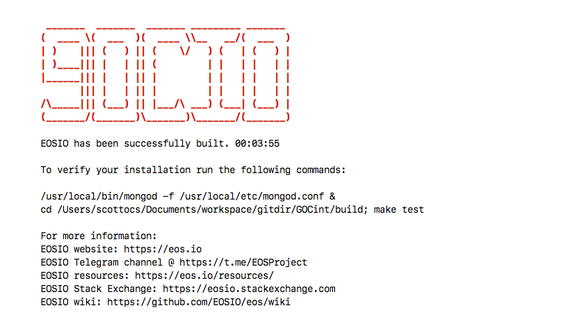
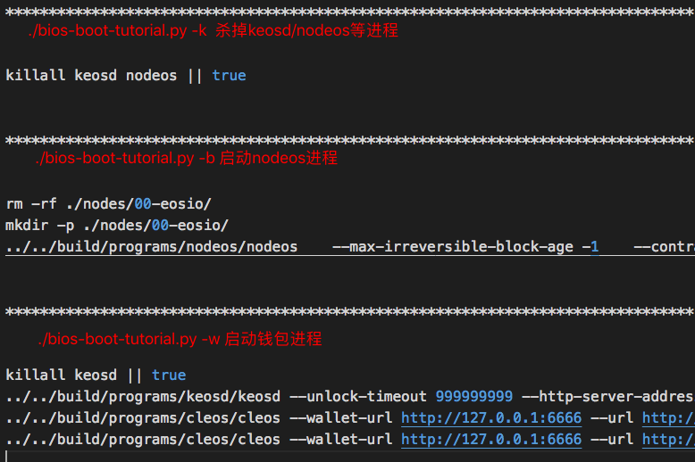
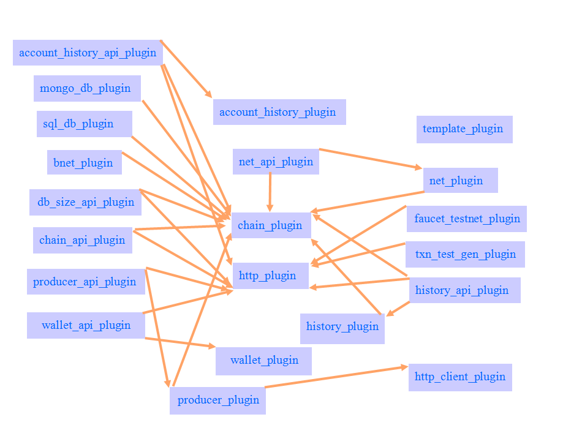
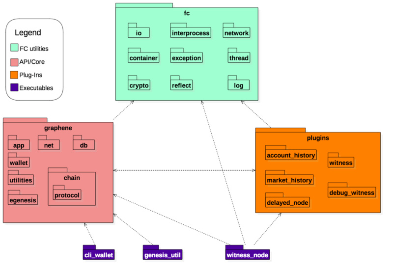
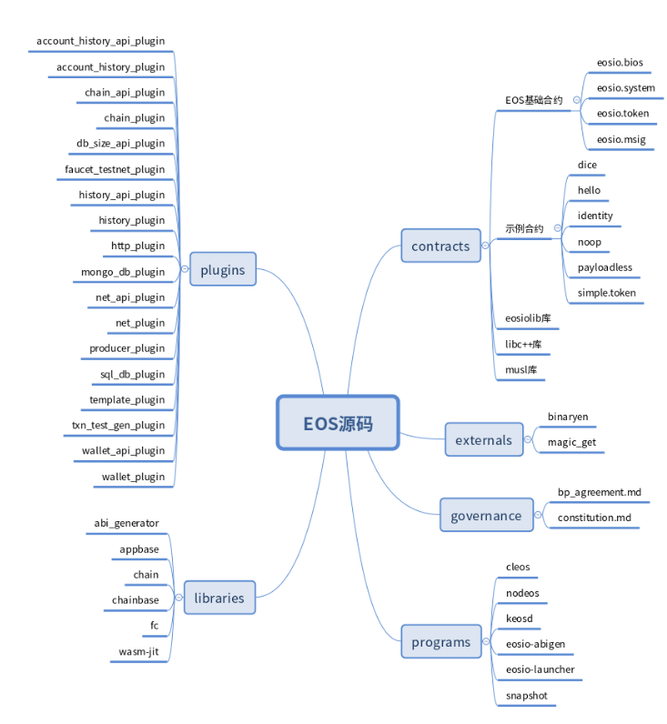

* faq是什么意思？
    * faq是frequent asked question的缩写
* 为什么要建立faq.md文档？
    * 由于EOS源码更新较快，其文档更新不及时，且存在纷繁复杂（如docker）的运行方式，经常出现一些卡壳的问题导致跟进者难以继续，因此有必要整理一些实用的工具使用说明、源码解读说明和踩过的坑的说明，以帮助新来者降低学习成本。
* GOC是什么意思？
    * GOC是governance of consensus的缩写，GOC是一条强调治理的公链，GOC的源码是从EOS分支得到，并且会根据需要将EOS最新的改动merge至GOC
* 开发环境
    * GOC项目是C++项目，目前仅在Linux Ubuntu和MacOSX上支持较好，编辑器兼编译器可采用VS Code
* VS Code必备插件

* 代码管理工具
    * GOC的代码在GitHub私有库上，由于项目结构复杂，开发人员众多，建议统一采用sourceTree(下载地址：https://www.sourcetreeapp.com/ 仅支持windows和mac版)进行管理，以便查看其他协作人员（包括EOS人员）提交的代码和注释。
* 密码学知识与背景
    * 注：密码学博大精深，GOC工程目前不做密码研究和密码技术攻关，旨在使用和分析现有的密码算法。
    * 哈希：指将任意原数据处理成一个只有数百字节以内的哈希值的算法。比如SHA256、SM3等
    * 公钥密码学：又称非对称密码学，是使用一对公钥和私钥的密码学，与对称密码学（只有一个密钥）相对应，私钥有自己存储，公钥对外公布。公钥密码学包括公钥加密算法和数字签名算法。
        * 大数分解、离散对数、椭圆曲线等数学工具常用来实现非对称密码，对于工程开发来说，无须关心数学原理，直接调用密码库的相关函数。常用的公钥密码体制有基于大数分解的RSA，和基于椭圆曲线的secp256k1.
        * 公钥密码体制常用来做加解密和签名验签功能。其中加解密发送者用公钥加密，接收者私钥解密；签名验签过程中常用私钥加密，公钥解密，具体来说是指：私钥持有者对消息m进行哈希得到h(m)，并用私钥对h(m)加密生成签名s，将消息m和签名s发送给其他人，其他人用公钥对签名s解密，得到h'(m),对消息m做哈希h(m)，然后通过对比h'(m)与h(m)一致判断验签是否成功。
        * 目前区块链（包括比特币、以太坊、EOS）基本上只用到了签名验签，并且不可缺少的依赖签名验签功能。

* 下载源码
    * 在新建的GOC的工作目录（以下简写成$GOC）下执行git clone https://github.com/bxliu/GOCint.git 或直接根据上述git地址在sourceTree中拉取。
* 编译源码
    * 在$GOC下执行./eosio_build.sh，若出现表示编译成功
    
* 编译脚本eosio_build.sh分析
    
* 常见编译问题
    * 编译中提示未下载依赖的子仓库，解决方法：按照提示抓取即可

* 编译产物cleos/nodeos/keosd作用与关系
    * 参考说明：https://developers.eos.io/eosio-home/docs/programs-and-tools    
    * nodeos: GOC的核心后台进程，nodeos可配置各种插件以作为恰当的节点运行。
    * cleos: GOC的命令行工具，采用REST API的形式与nodeos进行交互,是开发人员常用的命令接口。
    * keosd: GOC的轻量级钱包，用于管理钱包密钥和对交易签名。
    * 三者关系图：
* Eosiocpp工具
    * eosiocpp是将C++转化为wasm和abi的编译器。（wasm：WebAssembly的缩写，wasm的说明可以自行查阅搜索引擎，在GOC中可认为是智能合约对应的可执行文件，abi：Application Binary Interface,程序二进制文件,在EOS中是为了便于合约的接口描述和接口调用）。eosiocpp也即是合约代码的编译器。    

* 智能合约
    * 
* cleos/nodeos/keosd使用说明
    * 由于各命令的子命令较多，纷繁复杂，因此建议直接使用$GOC/tutorials/bios-boot-tutorial/bios-boot-tutorial.py文件，该文件包含了对cleos/nodeos/keosd命令的调用，通过学习和使用bios-boot-tutorial.py达到快速掌握GOC节点启动、钱包启动、创建公私钥、合约运行等命令
    * 编译后，可执行文件cleos/nodeos/keosd分别在$GOC/build/programs/cleos/ $GOC/build/programs/nodeos/
    $GOC/build/programs/keosd/ 目录下，建议将以上三个目录添加至环境变量，对应的源代码入口分别是$GOC/programs/cleos/main.cpp $GOC/programs/nodeos/main.cpp $GOC/programs/keosd/main.cpp 
* bios-boot-tutorial.py常用参数
    * 注：每执行下面一句话，请参考$GOC/tutorials/bios-boot-tutorial/output.log文件查看调用的命令。output.log部分内容如下： 
    * ./bios-boot-tutorial.py -k是干掉所有进程
    * ./bios-boot-tutorial.py -W用于清理目录，初始化钱包，导入私钥，-w快速启动keosd钱包，需要事先执行过-W动作
    * ./bios-boot-tutorial.py -b是启动nodeos
    * ./bios-boot-tutorial.py -sctST，做一串工作，分别是生成必要的系统账户，部署系统合约，发SYS币，部署system合约（就是我们主要修改的地方），生成一系列用户账户
    * ./bios-boot-tutorial.py -g是我增加的goc部分数据
    * ./bios-boot-tutorial.py -pPv是生成bp账户，启动bp节点，投票
* 上述动作使用到的cleos命令（查看output.log）
    * cleos create account
        * Usage: cleos create account [OPTIONS] creator name OwnerKey [ActiveKey]
    * cleos push action
        * Usage: cleos push action [OPTIONS] account action data
        * owner public key和active public key
    * cleos set contract
        * Usage: cleos set contract [OPTIONS] account contract-dir [wasm-file] [abi-file]
    * cleos get 
        * Usage: cleos get SUBCOMMAND
* GOC创建账号动作分解
    * ./bios-boot-tutorial.py -W 启动钱包时，详见stepStartNewWallet()函数
        * keosd（--http-server-address设定钱包服务地址，--wallet-dir设定钱包密钥存放位置）启动钱包
        * cleos wallet create --file xxxx（xxxx文件内容是钱包密码，注意密码与公私钥不是一回事）
        * cleos wallet import --private-key PRIVATEKEY导入公私钥
    * 注：关于cleos/nodeos/keosd的详细子命令可在命令行中查看，常用命令参考./bios-boot-tutorial.py中的用法
    
* GOC中的表，及CUDR

* GOC中内存、带宽、CPU

* GOC中的抵押、赎回

* GOC中的提案、投票

* GOC中的BP

* GOC中的GN

* GOC源码的plugin机制（待进一步解读）
    * 参考：https://www.cnblogs.com/hbright/p/9234998.html
    * 相互调用与依赖的关系：
* GOC源码架构（待进一步解读）
    * 视图1：
        
    * 视图2：
        
* systemAccounts有哪些，怎么用？
    'eosio.bpay',: EOS原生，per-block bucket
    'eosio.msig',: EOS原生
    'eosio.names',: EOS原生，Auction name
    'eosio.ram',: EOS原生，购买内存
    'eosio.ramfee',: EOS原生，购买内存手续费
    'eosio.saving',: EOS原生，增发的TOKEN，未划分部分
    'eosio.stake',: EOS原生，保存和归还CPU带宽抵押
    'eosio.token',: EOS原生，系统发币
    'eosio.vpay',: EOS原生，per-vote bucket
    'eosio.gocgns': GOC新增，用于保存GN奖励增发部分
    'eosio.gstake',: GOC新增，用于保存投票权限抵押部分，用户赎回时，从此账户取出费用
    'eosio.gocvs',: GOC新增，用于保存投票奖励增发部分，待实现

* 系统合约及作用
    * $GOC/contracts/eosio.bios
    * $GOC/contracts/eosio.msig
    * $GOC/contracts/eosio.system
    * $GOC/contracts/eosio.token

* 测试任务及步骤
    * 参考：https://shimo.im/docs/iuugYv6Wfrk5sZhe/
    * 一：GOC测试网组网程序
        * 1.GOC测试网启动程序
            * 步骤1：单节点初始化配置
            * 步骤2：系统合约部署
            * 步骤3：系统token生成及分发
            * 步骤4：单节点系统合约测试
            * 步骤5：系统权限下放
            * 步骤6：测试节点接入
            * 步骤7：网络联调
            * 步骤8：启动完毕         
        * 2. 步骤1：单节点初始化配置工作         
    * 二：GOC测试网测试程序     
        * 1.性能测试
        * 2.功能测试
     
    * 三：测试网组网及测试工具